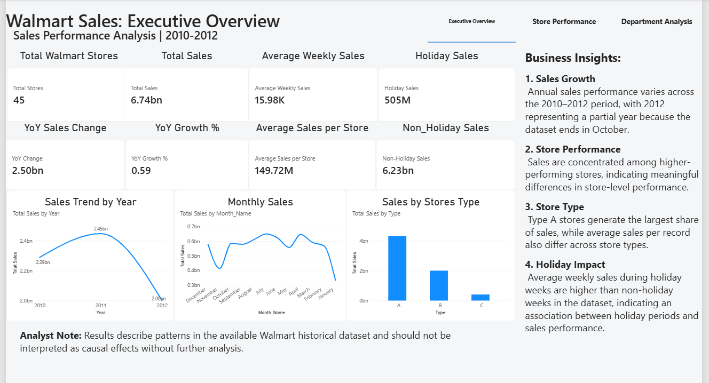
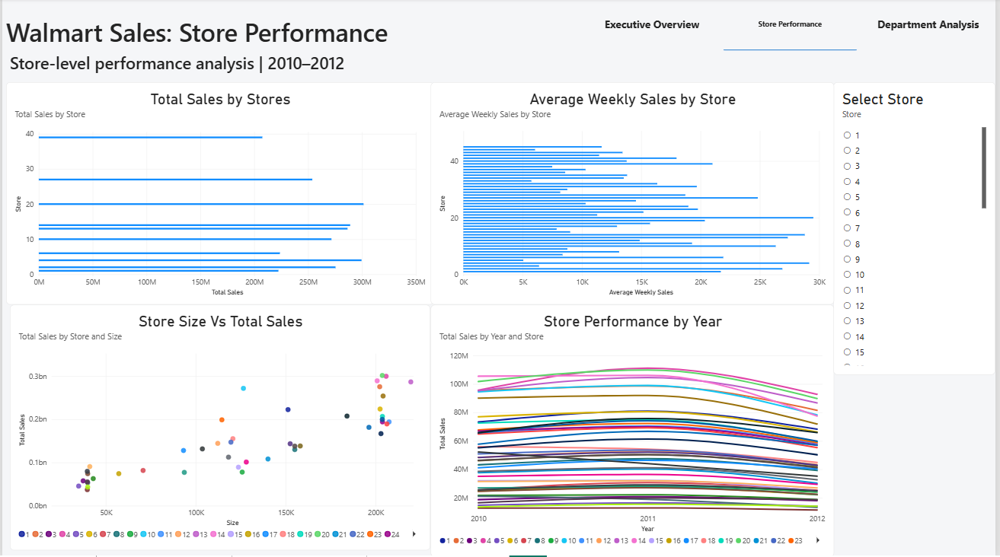
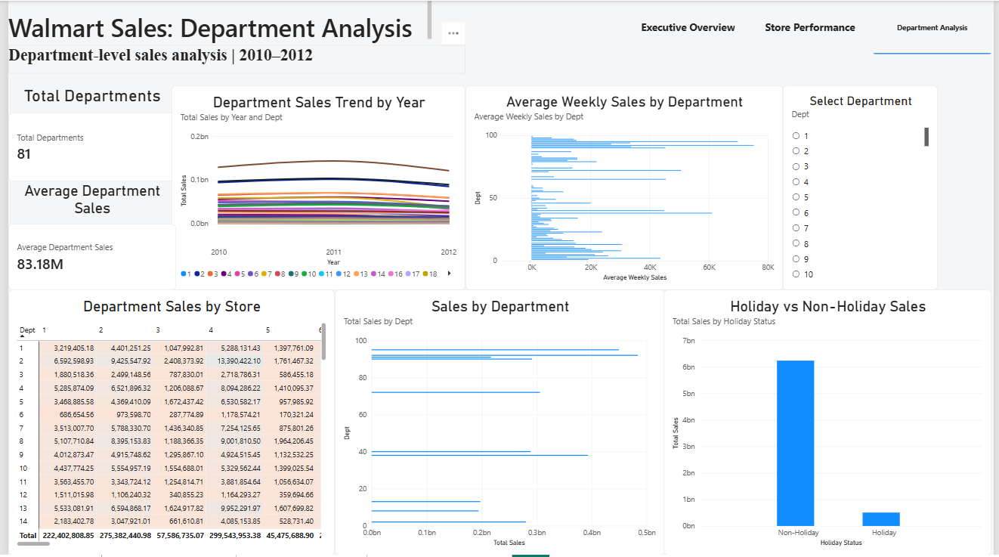

# Walmart Sales Analytics

## Project Overview

This project analyzes Walmart historical sales data from 2010 to 2012 using Python, MySQL, and Power BI.

The objective is to explore sales patterns, evaluate store and department performance, identify seasonal and holiday-related trends, and present key business insights through SQL analysis and an interactive Power BI dashboard.

The project demonstrates an end-to-end data analytics workflow, including:

- Data exploration and validation
- Exploratory Data Analysis (EDA) using Python
- Business-focused analysis using SQL
- Store and department performance analysis
- Year-over-year (YoY) sales analysis
- Interactive dashboard development using Power BI
- Business insight generation and data storytelling

> **Note:** The 2012 sales data is available only through October 26, 2012. Therefore, full-year comparisons involving 2012 should be interpreted carefully.


## Business Objectives

The analysis aims to answer the following business questions:

1. How did Walmart's sales performance change between 2010 and 2012?
2. What seasonal and monthly sales patterns are visible in the historical data?
3. How does sales performance differ between holiday and non-holiday weeks?
4. Which stores generate the highest sales, and how does performance vary across stores?
5. How do store type and store size relate to sales performance?
6. Which departments contribute the most to overall sales?
7. Which stores and departments experienced the strongest growth or decline year over year?
8. What patterns can be identified from promotional, economic, and external variables through exploratory analysis?

## Dataset

The project uses Walmart historical sales data covering 45 stores and multiple departments from February 2010 to October 2012.

### Files Used

- **train.csv** — Historical weekly sales data by store and department, including:
  - Store
  - Department
  - Date
  - Weekly Sales
  - Holiday indicator

- **stores.csv** — Store-level information, including:
  - Store
  - Store Type
  - Store Size

- **features.csv** — Additional economic and promotional variables used during Python exploratory analysis, including:
  - Temperature
  - Fuel Price
  - CPI
  - Unemployment
  - MarkDown1–MarkDown5
  - Holiday indicator

### Dataset Summary

- **Sales records:** 421,570
- **Stores:** 45
- **Departments:** 81
- **Sales period:** February 5, 2010 – October 26, 2012
- **Total historical sales:** Approximately $6.74 billion

> `features.csv` was used for Python exploratory analysis of economic and promotional variables. The SQL analysis focuses on the historical sales and store datasets.

## Tools & Technologies

| Tool | Purpose |
|------|---------|
| **Python** | Data cleaning, exploratory data analysis, statistical summaries, correlation analysis, and visualization |
| **Pandas** | Data manipulation, merging, aggregation, and data quality checks |
| **NumPy** | Numerical analysis and calculations |
| **Matplotlib & Seaborn** | Data visualization during exploratory analysis |
| **MySQL** | Business-focused sales analysis using SQL |
| **MySQL Workbench** | Database management and SQL query execution |
| **Power BI** | Interactive dashboard development and business data visualization |
| **DAX** | KPI measures, YoY calculations, holiday analysis, and dashboard metrics |
| **Jupyter Notebook** | Python analysis and documentation |
| **Git & GitHub** | Version control and project portfolio presentation |

## Project Workflow

The project follows an end-to-end analytics workflow:

### 1. Python — Exploratory Data Analysis
- Loaded and inspected the sales, store, and feature datasets
- Assessed missing values, duplicates, and unusual sales values
- Prepared date-related features for analysis
- Explored yearly and monthly sales patterns
- Analyzed top-performing stores and departments
- Compared holiday and non-holiday sales
- Examined the distribution of Weekly Sales and identified outliers using the IQR method
- Explored store size in relation to sales
- Analyzed correlations with economic variables such as CPI, unemployment, fuel price, and temperature
- Investigated promotional Markdown variables and department sales variability

### 2. MySQL — Business Analysis
- Validated the historical sales dataset
- Calculated overall and yearly sales KPIs
- Analyzed monthly and seasonal sales patterns
- Compared holiday and non-holiday performance
- Evaluated store and store-type performance
- Analyzed department-level sales
- Used CTEs and window functions for ranking and Year-over-Year (YoY) analysis
- Identified stores and departments with notable growth and decline

### 3. Power BI — Dashboard & Data Storytelling
- Built an interactive three-page Power BI dashboard
- Created KPI measures using DAX
- Developed Executive Overview, Store Performance, and Department Analysis pages
- Added filters and navigation for interactive exploration
- Presented key sales trends and business insights visually

### 4. Business Insights
Findings from Python, SQL, and Power BI were combined to summarize historical sales performance, seasonal patterns, store and department performance, and other notable relationships in the data.

## Python EDA Highlights

Python was used for deeper exploratory analysis of sales distributions, outliers, store characteristics, economic variables, promotional Markdown features, and department variability.

### Sales Distribution & Outliers
- Weekly Sales showed a highly uneven distribution with several extreme high-sales observations.
- Using the IQR method, approximately **35,521 records (8.43%)** were identified as statistical outliers.
- The highest individual Weekly Sales value was approximately **$693,099**.
- Many of the highest individual sales observations occurred in **Department 72** and around holiday periods.

### Store Characteristics
- Store size showed a general positive relationship with sales.
- Larger stores tended to generate higher sales, although store size alone did not fully explain performance differences.

### Economic Factors
Correlation analysis showed very weak linear relationships between Weekly Sales and the selected economic variables:

- Temperature: approximately **-0.002**
- Fuel Price: approximately **0.000**
- CPI: approximately **-0.021**
- Unemployment: approximately **-0.026**

These results suggest that none of these variables individually had a strong linear relationship with Weekly Sales in this dataset.

### Promotional Markdown Analysis
- MarkDown variables contained substantial missing data, with approximately **64%–74%** of observations missing depending on the Markdown field.
- Individual Markdown variables showed relatively weak correlations with Weekly Sales.
- MarkDown1 and MarkDown5 had the strongest correlations with Weekly Sales among the Markdown variables, at approximately **0.085** and **0.090**, respectively.
- MarkDown1 and MarkDown4 were strongly correlated with each other at approximately **0.819**.

### Department Sales Variability
Sales volatility differed substantially across departments. Some departments showed relatively stable performance, while others displayed considerably greater variation over time.

> Correlation and exploratory patterns describe associations in the historical data and should not be interpreted as evidence of causation.


## SQL Analysis Highlights

MySQL was used to perform business-focused analysis of historical sales, store performance, department performance, and Year-over-Year (YoY) trends.

### Overall Sales Performance
- The dataset contains **421,570 sales records**.
- Total historical sales were approximately **$6.74 billion**.
- Average Weekly Sales were approximately **$15,981.26**.
- Total sales increased by approximately **6.96% from 2010 to 2011**.
- The 2012 dataset ends on October 26, so 2012 totals are not directly comparable with complete-year results.

### Seasonal & Holiday Performance
- **December** recorded the highest monthly sales in both 2010 and 2011.
- Average Weekly Sales during holiday weeks were approximately **$17,035.82**, compared with **$15,901.45** during non-holiday weeks.
- Holiday weeks therefore showed approximately **7.13% higher average sales** in the historical data.

### Store Performance
- **Store 20** generated the highest total sales at approximately **$301.4M**.
- **Store 4** followed closely with approximately **$299.5M**.
- Type A stores recorded the highest total and average Weekly Sales among the three store types.
- Store performance varied considerably across locations.

### Department Performance
- **Department 92** generated the highest total sales at approximately **$483.94M**.
- **Department 95** followed with approximately **$449.32M**.
- Department-level performance varied substantially across the dataset.

### Year-over-Year Performance
Among departments with more than $1M in 2010 sales:

- **Department 87** recorded the highest 2011 YoY growth at **22.74%**.
- **Department 59** recorded a **48.12% decline** in 2011.

At the store level:

- **Store 38** recorded **20.21% YoY growth** in 2011.
- **Store 35** recorded a **15.54% decline**.

### SQL Techniques Demonstrated
- Aggregate functions
- `GROUP BY` and `HAVING`
- Joins
- Common Table Expressions (CTEs)
- Window functions
- `LAG()` for YoY calculations
- `RANK()` for performance ranking
- Conditional aggregation
- Date-based analysis

> These results describe historical patterns and associations and should not be interpreted as causal relationships.


## Power BI Dashboard

An interactive three-page Power BI dashboard was developed to present the analysis in a clear, business-focused format.

### 1. Executive Overview

The Executive Overview provides a high-level summary of Walmart's historical sales performance, including key KPIs, sales trends, store-type performance, and major business insights.



### 2. Store Performance

The Store Performance page focuses on store-level results, allowing users to compare sales across stores and explore performance by store characteristics.



### 3. Department Analysis

The Department Analysis page highlights department-level sales performance, top-performing departments, and sales trends across departments.



### Dashboard Features

- Interactive page navigation
- Store filtering
- KPI cards
- Sales trend analysis
- Store and department comparisons
- Holiday sales analysis
- DAX-based measures
- Year-over-Year performance metrics

## Key Business Insights

- Walmart generated approximately **$6.74B in historical sales** across the analyzed period.
- Sales increased by approximately **6.96% from 2010 to 2011**, while 2012 represents only a partial year.
- **December** was the strongest sales month in both complete years, indicating an important seasonal pattern.
- Holiday weeks recorded approximately **7.13% higher average Weekly Sales** than non-holiday weeks.
- **Store 20** was the highest-performing store by total sales, while **Department 92** was the highest-performing department.
- Performance varied substantially across stores and departments, with notable differences in YoY growth and decline.
- Store size generally showed a positive relationship with sales, but size alone did not explain store performance.
- Temperature, fuel price, CPI, and unemployment showed **very weak linear correlations** with Weekly Sales.
- Promotional Markdown variables contained substantial missing data and showed relatively weak individual correlations with Weekly Sales.

### Business Takeaway

The analysis highlights the importance of seasonality, holiday periods, and differences in store and department performance. These patterns can help guide further investigation into inventory planning, promotional strategy, and performance monitoring, while additional analysis would be required before drawing causal conclusions.

## Repository Structure

```text
Walmart-Sales-Analytics/
│
├── data/
│   ├── train.csv
│   ├── stores.csv
│   └── features.csv
│
├── python/
│   └── 01_walmart_eda.ipynb
│
├── sql/
│   ├── 00_database_setup.sql
│   ├── 01_data_validation.sql
│   ├── 02_sales_analysis.sql
│   ├── 03_store_analysis.sql
│   ├── 04_department_analysis.sql
│   └── 05_business_insights.sql
│
├── powerbi/
│   └── Walmart_Sales_Analytics.pbix
│
├── screenshots/
│   ├── executive_overview.png
│   ├── store_performance.png
│   └── department_analysis.png
│
└── README.md
```


## Conclusion

This project demonstrates an end-to-end data analytics workflow using Python, MySQL, and Power BI.

Python was used for exploratory analysis, data quality assessment, outlier analysis, correlations, and investigation of economic and promotional variables. MySQL was used for business-focused sales analysis, including store and department performance, rankings, and Year-over-Year calculations. Power BI was used to transform the results into an interactive dashboard for business reporting and data storytelling.

The analysis identified clear differences in performance across time periods, stores, departments, and holiday conditions while also highlighting the limitations of drawing causal conclusions from historical observational data.

This project demonstrates practical skills in data exploration, SQL analysis, visualization, dashboard development, and communicating analytical findings.
